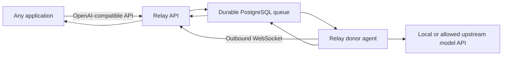

# Relay API-First MVP Implementation Plan

## 0. Product context

### The problem

Useful inference capacity is fragmented and frequently idle:

- Developers run capable open models on personal workstations that sit unused for much of the day.
- Teams have spare inference capacity on machines that are not exposed through a stable application interface.
- A consumer application wants one dependable API, not separate integrations for every machine, model server, or coding client.
- Community capacity is intermittent. A host may be offline when a request arrives or disappear while it is working.
- A host willing to contribute capacity still needs firm control over model access, schedule, concurrency, memory, token usage, and daily limits.

Existing model APIs assume a continuously available provider. A raw tunnel to a personal machine does not solve durable queueing, donor replacement, fair scheduling, capability matching, privacy disclosure, or host-side limits.

### Product vision

Relay is a permissioned inference network that turns independent model providers into one stable API.

Requesters should be able to submit work without knowing which host will perform it or whether a host is online at that moment. Donors should be able to contribute a tightly bounded amount of inference without exposing credentials, opening inbound ports, or surrendering control of their machines.

The long-term vision is broader than a model proxy:

> Applications request an AI capability from Relay; Relay finds permitted capacity, waits when necessary, survives host churn, and returns a verifiable result.

The API-first MVP deliberately tests the inference layer before adding agent runtimes, repository access, or remote code execution.

### Why build this

Relay can create value for both sides of the network:

#### For consumers

- One OpenAI-compatible base URL instead of provider-specific integrations.
- Access to donated or community-supplied inference.
- Durable async jobs that can wait for capacity instead of immediately failing.
- Host failover without selecting or monitoring individual machines.
- A path to use the same endpoint from scripts, applications, frameworks, and optional coding agents.

#### For donors

- A simple way to contribute otherwise idle inference capacity.
- No inbound public listener and no consumer access to provider credentials.
- Local control over models, schedule, concurrency, tokens, request size, and daily usage.
- Immediate pause, cancellation, and revocation.
- No execution of requester tools, shell commands, repositories, or generated code in this MVP.

#### For the platform

- A reusable scheduling and compatibility layer across heterogeneous inference backends.
- A foundation for trusted pools, sponsored inference, provider partnerships, agent integrations, and optional paid capacity later.
- Network value based on availability, reliability, compatibility, and safety rather than owning model infrastructure.

### Why the first MVP is API-only

The larger idea originally included running coding agents and executing code on local machines. That combines several difficult problems at once: model routing, durable orchestration, filesystem safety, command isolation, resource enforcement, credentials, agent recovery, and public API design.

The API-only MVP removes code execution and focuses on the core unknowns:

1. Can consumers use one stable endpoint across intermittent donors?
2. Will donors install a lightweight agent and contribute bounded inference?
3. Can Relay match heterogeneous models accurately enough for useful results?
4. Can a queued request survive donor loss and complete elsewhere?
5. Is waiting for free or community inference acceptable for asynchronous workloads?

This scope is faster to build, easier to explain, safer to operate, and easier to demonstrate. If these hypotheses fail, there is no reason to build the more complex execution layer. If they succeed, Codex, OpenCode, SDKs, trusted execution pools, and other consumers can be added on top of the same API.

### Product terminology

Relay should describe the supplied resource as **donated inference capacity**, not transferable “tokens.” Tokens are a measurement of model input/output usage and may not be a transferable asset under a provider's terms.

The scheduling experience is torrent-like in the sense that capacity appears and disappears across independent hosts. The implementation is not a BitTorrent content-distribution protocol: the MVP uses a central authenticated broker, durable queue, and leased jobs.

### Initial users and use cases

#### Consumer developer

Wants an OpenAI-compatible endpoint for experiments, background generation, evaluation, summarization, or non-urgent automation. They value low integration effort and can tolerate queueing.

#### Donor

Already operates a local OpenAI-compatible model server or another explicitly permitted inference source. They want to donate limited capacity without exposing their machine or credentials.

#### Advanced Codex user

May point Codex at Relay as an experimental custom Responses provider. Relay does not install, manage, or run Codex in the MVP.

Good MVP workloads:

- Background text and code generation.
- Summarization and transformation.
- Non-urgent batch-like prompts.
- Community demos and hackathon applications.
- Experiments where best-effort availability is acceptable.

Poor MVP workloads:

- Latency-sensitive interactive chat.
- Confidential or regulated prompts.
- Guaranteed production SLAs.
- Work requiring one exact proprietary model.
- Tool execution or access to private repositories.

### Core hypotheses and measurements

| Hypothesis | MVP measurement |
|---|---|
| Consumers will integrate a community endpoint | API keys created, first successful request, repeat consumers |
| Donors will contribute bounded capacity | Activated donors, online hours, completed jobs per donor |
| Consumers will wait for free capacity | Queued-job completion rate and cancellation rate by wait time |
| Host churn can be hidden | Lease-expiry recovery rate and attempts per completed job |
| Virtual model classes are useful | Compatibility pass rate, completion success, consumer retry rate |
| Setup is sufficiently easy | Time from install command to first donated completion |

The MVP should optimize for learning rather than raw scale. Ten reliable donors and a handful of recurring consumers provide more useful evidence than a large signup count with no completed jobs.

### Differentiation

Relay is not differentiated by forwarding an OpenAI-shaped request. Its defensible product layer is:

- Durable queueing across intermittent community capacity.
- Capability-aware matching rather than a static upstream URL.
- Atomic completion and reassignment after donor failure.
- Donor-owned hard limits and outbound-only connectivity.
- Virtual model identities over heterogeneous backends.
- Honest availability and privacy semantics.
- Compatibility with existing consumer applications.

### Product progression

Build in this order:

1. **API-first community inference:** public/non-sensitive prompts, open or explicitly permitted models, durable jobs.
2. **Trusted pools:** friends, teams, organizations, and allowlisted donors.
3. **Sponsored capacity:** centrally funded or provider-approved inference pools.
4. **Broader clients:** SDKs, OpenCode, stronger Codex compatibility, workflow tools.
5. **Optional execution layer:** only after isolated execution, credential boundaries, and recovery are independently proven safe.

The MVP must not depend on the later stages to be useful.

## 1. MVP decision

Relay's first release is a consumer-agnostic inference-sharing API.

Consumers call a normal OpenAI-compatible HTTP API. Donors install a small host agent that connects an allowed local or upstream inference provider to Relay. The hosted Relay control plane authenticates consumers, queues requests, matches them to available donors, leases work, retries failed attempts, and returns results.

Relay does **not** run Codex, edit repositories, or execute commands in this MVP. Codex is an optional client because Relay exposes the Responses API shape Codex can use as a custom model provider.

This version demonstrates the core idea with the least engineering:

> A requester submits inference through one stable API, the request waits when no donated capacity exists, and any compatible donor can complete it later.

## 2. Success criteria

The MVP is successful when:

1. A consumer can obtain a Relay API key without installing software.
2. `GET /v1/models` returns available virtual models.
3. `POST /v1/chat/completions` works with an ordinary OpenAI-compatible client when capacity is online.
4. `POST /v1/responses` supports the minimum protocol needed for Codex custom-provider experiments.
5. `POST /v1/jobs` accepts durable asynchronous inference and immediately returns `202 Accepted`.
6. With no donor online, an async job remains queued.
7. When a compatible donor connects, the oldest compatible job starts automatically.
8. If that donor disappears before committing a result, the job is reassigned without user intervention.
9. A donor can configure model, schedule, concurrency, request limits, and daily token limits locally.
10. A donor can start with one command and pause instantly.
11. A complete two-machine demo can be set up in less than ten minutes, excluding model download.

## 3. Scope

### Included

- OpenAI-compatible consumer authentication with Relay API keys.
- `GET /v1/models`.
- `POST /v1/chat/completions` with non-streaming and buffered SSE compatibility.
- `POST /v1/responses` with a documented supported subset.
- Native durable asynchronous Jobs API.
- Optional SSE job events.
- Completion webhooks.
- Central durable queue.
- First-compatible, first-served scheduling with fair-share limits.
- Donor capability advertisement.
- Donor leases, heartbeats, expiry, and reassignment.
- Atomic result commitment.
- OpenAI-compatible donor backends, including local open-model servers.
- Host-configured concurrency, schedule, request size, token, timeout, and daily budgets.
- Bun/TypeScript donor CLI distributed as a package during alpha and a standalone executable for releases.
- A personal Homebrew tap after the CLI stabilizes.
- Optional manual Codex custom-provider instructions.

### Excluded

- Running Codex or OpenCode on behalf of the consumer.
- Repository access, code execution, shells, files, builds, tests, and artifacts.
- Live token streaming before a donor result is committed.
- Embeddings, images, audio, fine-tuning, batches, and legacy completions.
- Consumer subscriptions as an officially supported donor source.
- Payments, donor earnings, escrow, reputation, or a marketplace.
- Private prompt confidentiality from the donor or Relay control plane.
- End-to-end encryption against the machine performing inference.
- Multi-region infrastructure.
- Official Homebrew Core submission.

## 4. Architecture



### Consumer side

No Relay installation is required. Consumers use:

- `curl`.
- OpenAI-compatible SDKs.
- AI frameworks that accept a custom base URL.
- Codex through a user-configured custom provider.
- Any future consumer that supports Chat Completions or Responses.

### Donor side

The donor agent:

- Connects outbound to Relay over authenticated WebSocket.
- Advertises models and verified capabilities.
- Accepts short-lived inference leases.
- Calls a model endpoint configured by the donor.
- Returns a complete normalized result.
- Never exposes the donor credential to Relay consumers.
- Never executes code or tools.

### Control plane

The control plane:

- Authenticates consumers and donors.
- Persists jobs, attempts, events, and leases.
- Matches pending work to compatible donors.
- Enforces platform and consumer quotas.
- Accepts exactly one committed result per job.
- Handles polling, events, cancellation, and webhooks.

## 5. Bun workspace monorepo

Use one Bun/TypeScript workspace monorepo. Bun manages dependencies, scripts, tests, development servers, package publishing, and standalone donor executables.

```text
/
├── apps/
│   ├── api/                 # Hono API, SSE, WebSocket, and scheduler process
│   ├── host/                # Donor CLI and background worker
│   └── web/                 # Reserved for a small dashboard after the API demo
├── packages/
│   ├── config/              # Environment parsing and shared defaults
│   ├── db/                  # PostgreSQL client, migrations, and repositories
│   ├── protocol/            # Zod schemas, JSON Schema, and wire types
│   ├── openai-compat/       # Chat Completions and Responses normalization
│   ├── scheduler/           # Pure matching, limits, leases, and fairness logic
│   ├── sdk/                 # Consumer TypeScript SDK generated from the API
│   └── testkit/             # Mock donor, fixtures, clocks, and failure helpers
├── tooling/
│   └── build-host.ts        # Cross-platform standalone executable builds
├── migrations/              # Ordered SQL migrations
├── deploy/
│   └── docker-compose.yml   # API + PostgreSQL + mock provider
├── docs/
│   ├── api.md
│   ├── donor.md
│   └── codex.md
├── package.json
├── bun.lock
├── bunfig.toml
└── tsconfig.base.json
```

Root `package.json`:

```json
{
  "name": "relay",
  "private": true,
  "workspaces": ["apps/*", "packages/*"],
  "catalog": {
    "hono": "^4",
    "zod": "^4",
    "postgres": "^3"
  },
  "scripts": {
    "dev": "bun --filter '*' dev",
    "test": "bun test",
    "typecheck": "bun --filter '*' typecheck",
    "lint": "bun --filter '*' lint",
    "build": "bun --filter '*' build",
    "build:host": "bun run tooling/build-host.ts"
  }
}
```

Internal packages use the workspace protocol:

```json
{
  "dependencies": {
    "@relay/protocol": "workspace:*",
    "@relay/config": "workspace:*"
  }
}
```

Technology choices:

- Pin the Bun version in CI and contributor documentation.
- Hono on Bun for HTTP routes, SSE, and WebSocket upgrades.
- `@hono/zod-openapi` so validation schemas generate OpenAPI documentation.
- PostgreSQL as the durable queue and source of truth.
- `postgres` for database access; keep SQL visible rather than adding an ORM in the MVP.
- Zod for runtime validation at every network boundary.
- `bun:test` for unit, integration, and failure-injection tests.
- OpenTelemetry for metrics and traces when the core path works.

Package boundaries:

- Apps may depend on packages.
- Packages must not depend on apps.
- `protocol` has no database or HTTP framework dependency.
- `scheduler` is deterministic and testable without PostgreSQL.
- `openai-compat` contains no queue or donor-selection logic.
- `db` owns transactions and persistence but not business policy.

Use `bun install` once at the repository root. Run a single app with `bun --filter @relay/api dev` or the whole workspace with `bun run dev`.

Do not add Turborepo, Nx, Redis, Kafka, NATS, Kubernetes, or microservices to the MVP. Bun workspaces plus one API process and PostgreSQL are sufficient.

## 6. Consumer API

### 6.1 Authentication

```http
Authorization: Bearer lr_live_...
```

API keys are random high-entropy values. Store only a secure hash and key prefix. Support immediate revocation.

### 6.2 Model discovery

```http
GET /v1/models
```

```json
{
  "object": "list",
  "data": [
    {
      "id": "community-auto",
      "object": "model",
      "owned_by": "relay-community",
      "metadata": {
        "availability": "best-effort",
        "chat_completions": true,
        "responses": true,
        "tools": false
      }
    }
  ]
}
```

Expose virtual model IDs rather than individual donor machine names. The scheduler maps a virtual model to a compatible backend.

### 6.3 Chat Completions

```http
POST /v1/chat/completions
```

Minimum accepted body:

```json
{
  "model": "community-auto",
  "messages": [
    {"role": "user", "content": "Explain this function"}
  ],
  "temperature": 0.2,
  "max_tokens": 1000,
  "stream": false
}
```

MVP behavior:

- Non-streaming is the canonical execution path.
- Accept `stream: true`, but buffer the donor's complete result before emitting a standards-shaped SSE sequence. This provides client compatibility without exposing partial output that cannot be failed over safely.
- Validate and cap message count, body size, and requested output tokens.
- Preserve supported system, user, assistant, and tool messages.
- Return explicit errors for unsupported parameters.
- Wait only a short period, such as 5 seconds, to acquire capacity for a synchronous request. After a lease is acquired, apply the normal inference deadline, such as 5 minutes.
- If no compatible donor is available, return `503` with `Retry-After` and direct the caller to the durable Jobs API.

Do not hold a synchronous connection for hours.

### 6.4 Responses

```http
POST /v1/responses
```

Support a deliberately small subset:

- `model`.
- `instructions`.
- Text `input` and message-like input items.
- Basic tools/function definitions after the text path is stable.
- `max_output_tokens`.
- `stream: false` as the canonical path.
- Buffered `stream: true` SSE compatibility after the response is atomically committed.
- Response IDs, output items, output text, status, and usage.

Codex compatibility is experimental until tested against the current CLI. Relay must not claim full Responses API compatibility.

### 6.5 Durable asynchronous jobs

```http
POST /v1/jobs
```

```json
{
  "request": {
    "api": "chat.completions",
    "model": "community-auto",
    "messages": [
      {"role": "user", "content": "Write release notes for this diff"}
    ],
    "max_tokens": 2000
  },
  "queue": {
    "max_wait_seconds": 86400
  },
  "webhook_url": "https://example.com/hooks/relay"
}
```

Return:

```http
202 Accepted
```

```json
{
  "id": "job_123",
  "status": "queued",
  "status_url": "/v1/jobs/job_123",
  "events_url": "/v1/jobs/job_123/events",
  "result_url": "/v1/jobs/job_123/result"
}
```

Additional endpoints:

```text
GET    /v1/jobs/{job_id}
GET    /v1/jobs/{job_id}/events
GET    /v1/jobs/{job_id}/result
DELETE /v1/jobs/{job_id}
POST   /v1/jobs/{job_id}/retry
```

Use `Idempotency-Key` on job creation. Support SSE replay with `Last-Event-ID`.

#### Receiving progress and results after disconnecting

The `202 Accepted` response is the handoff point: the consumer persists `job_123` and may disconnect immediately. The job continues independently of the HTTP connection. A consumer can then use any of three delivery patterns:

1. **Polling:** call `GET /v1/jobs/{job_id}` with exponential backoff. The response includes the current state, queue position when it can be calculated cheaply, compatible donors online, attempt count, timestamps, and a coarse progress message. When the state becomes `succeeded`, fetch `result_url`.
2. **Replayable SSE:** connect to `GET /v1/jobs/{job_id}/events`. Every event has a persisted monotonically increasing ID. If the browser, CLI, or network disconnects, reconnect with `Last-Event-ID`; Relay replays missed events before following live ones. SSE is an observation channel, not the owner of the job, so closing it never cancels work.
3. **Signed webhook:** supply `webhook_url` when creating the job. Relay posts terminal events such as `job.succeeded`, `job.failed`, `job.expired`, or `job.cancelled`, signs the request, and retries delivery with backoff. The consumer can then fetch the canonical result from `result_url`.

Progress is intentionally state-based in the MVP: `queued`, `matching`, `leased`, `running`, and a terminal state. Do not promise a precise percentage because most inference backends cannot produce one reliably. Useful event payloads include queue-entry time, attempt number, lease/retry changes, and terminal status. Token deltas remain post-MVP because a donor can disappear mid-stream and force a clean retry elsewhere.

Protect every status, event, and result URL with the consumer API key and job ownership check. Retain completed results for a configurable period (seven days by default), expose `expires_at`, and allow early deletion with `DELETE /v1/jobs/{job_id}`.

### 6.6 Health and capability endpoints

```text
GET /healthz
GET /readyz
GET /v1/capabilities
```

`/v1/capabilities` documents the exact supported OpenAI-compatible features and limits.

## 7. Status and error contract

Job states:

```text
queued
matching
leased
running
completed
failed
cancelled
expired
```

Recoverable attempt outcomes:

```text
host_disconnected
lease_expired
provider_timeout
provider_overloaded
malformed_response
```

Consumer-facing errors use an OpenAI-style envelope:

```json
{
  "error": {
    "message": "No compatible donated inference host is currently available.",
    "type": "relay_capacity_unavailable",
    "code": "capacity_unavailable",
    "param": null
  }
}
```

Return meaningful status codes:

- `400` invalid request.
- `401` invalid API key.
- `403` key lacks scope.
- `404` unknown model or job.
- `409` invalid job transition.
- `413` body too large.
- `429` account or pool quota exceeded.
- `503` synchronous capacity unavailable.
- `504` synchronous inference timeout.

## 8. Queue, matching, and availability

### Scheduling

Use first-compatible, first-served with aging and basic fair sharing:

1. Filter hosts by virtual model, protocol version, context size, feature support, token limits, donor schedule, and concurrency.
2. Select the oldest eligible pending job.
3. Avoid assigning more than one concurrent job per consumer until others have had a chance.
4. Prefer a previous host only for retry locality; never depend on host state.

### PostgreSQL queue

Use PostgreSQL transactions and `FOR UPDATE SKIP LOCKED` to claim pending jobs. Do not use an in-memory-only queue.

Core tables:

```text
accounts
api_keys
donors
donor_models
jobs
job_events
attempts
leases
webhook_deliveries
```

Important constraints:

- Unique job idempotency key per API key.
- At most one active lease per job.
- At most one committed attempt per job.
- Monotonic job state version.
- Indexed lease expiry.

### Lease behavior

- Donor heartbeat every 5 seconds.
- Lease duration 20 seconds, renewed while generating.
- Three missed heartbeats mark the donor offline.
- Expired leases are reclaimed by a periodic database worker.
- A late donor result is rejected if its lease no longer owns the job.

### No hosts available

For `/v1/jobs`, remain queued until:

- A compatible host comes online.
- `max_wait_seconds` expires.
- The consumer cancels.

For synchronous OpenAI-compatible endpoints, wait briefly and then return `503` with `Retry-After`.

## 9. Failure and retry semantics

### Async jobs

Donor output is buffered until complete:

1. Donor receives a leased request.
2. Donor calls its backend.
3. Donor keeps the lease alive with heartbeats/progress metadata.
4. Donor returns one complete normalized result plus a content hash.
5. Control plane validates size, shape, model, usage, and lease ownership.
6. A transaction commits the first valid attempt.
7. Later attempts are discarded.

If the donor dies before commit, the job returns to `queued` and another host can retry it.

### Synchronous non-streaming requests

Use the same atomic completion rule. If the connected donor dies, retry only while the request deadline remains; otherwise return a retryable error.

### Streaming

The MVP supports **buffered streaming compatibility**, not live token streaming:

1. Relay waits for a complete, committed donor result.
2. It then emits the normal Chat Completions or Responses SSE event sequence.
3. Clients that require `stream: true` remain compatible, but the first event arrives only after inference finishes.

Live token streaming is post-MVP because a host cannot be swapped transparently after bytes reach the consumer without duplicates or discontinuity. When live streaming is added, a broken stream terminates with a retryable error; Relay must not claim seamless mid-stream failover.

## 10. Donor protocol

Donors connect to:

```text
WSS /v1/donors/connect
```

Message types:

```text
hello
capabilities
heartbeat
lease.offer
lease.accept
lease.reject
attempt.started
attempt.progress
attempt.completed
attempt.failed
lease.cancel
```

Each message includes:

- Protocol version.
- Connection session ID.
- Monotonic sequence number.
- Donor ID.
- Job/attempt/lease ID where relevant.

Use Zod schemas and reject unknown privileged message types.

## 11. Donor configuration and safety

Example local configuration:

```yaml
provider:
  type: openai-compatible
  base_url: http://127.0.0.1:11434/v1
  model: local-coder

limits:
  concurrency: 1
  max_input_tokens: 30000
  max_output_tokens: 8000
  request_timeout: 5m
  daily_tokens: 100000
  daily_requests: 50

schedule:
  mode: nights
  require_external_power: true
  minimum_battery: 30
```

Donor invariants:

- Local policy is authoritative.
- The control plane cannot raise donor limits.
- No inbound public listener is required.
- Donor provider credentials never appear in jobs or consumer responses.
- The donor executes no tool calls or generated code.
- Request and response bodies are bounded.
- Donor can pause or stop immediately.
- Donor logs omit prompt bodies by default.

Effective limits are the minimum of consumer request, platform policy, donor policy, and backend capability.

## 12. Donor installation

### Fastest MVP path

Publish the host agent as a Bun package during the developer alpha:

```bash
bunx @relay/host setup
bunx @relay/host start
```

For the public demo, compile it into a standalone executable so donors do not need Bun, Node.js, or repository dependencies installed:

```bash
bun build apps/host/src/index.ts --compile --outfile dist/relay-host
```

Bun can cross-compile the same TypeScript entrypoint for macOS, Linux, and Windows. The release workflow should produce checksummed archives for supported operating systems and architectures.

User-facing installation becomes:

```bash
curl -fsSL https://relay.example/install.sh | sh
relay-host setup
relay-host start
```

The installer only selects and verifies the correct signed/checksummed release artifact; it does not install a language runtime.

### Homebrew

Publishing through a personal tap is straightforward and does not require Homebrew Core approval:

```bash
brew tap relay/tap
brew install relay-host
```

Implementation:

1. Create a `relay/homebrew-tap` GitHub repository.
2. Publish the Bun-compiled, versioned standalone archives in GitHub Releases.
3. Add a Formula containing release URLs and SHA-256 checksums.
4. Automate formula updates in the release workflow.

Do this after the CLI command surface stops changing. Official Homebrew Core inclusion is not an MVP dependency.

### Demo install target

For the demo, support:

```bash
relay-host start \
  --provider http://127.0.0.1:11434/v1 \
  --model local-coder
```

The command opens browser pairing, runs compatibility checks, confirms limits, and begins donating.

## 13. Optional Codex connection

Relay does not install or run Codex in the MVP. A user may point their own Codex CLI at Relay's `/v1/responses` endpoint.

Example user profile:

```toml
# ~/.codex/relay.config.toml
model = "community-auto"
model_provider = "relay"

[model_providers.relay]
name = "Relay Community"
base_url = "https://api.relay.example/v1"
wire_api = "responses"
env_key = "RELAY_API_KEY"
```

Run:

```bash
RELAY_API_KEY=lr_live_... codex --profile relay
```

Limitations:

- Codex compatibility remains experimental until the Responses subset passes real Codex fixtures.
- Interactive Codex requires a donor to be available; Codex does not consume Relay's async Jobs API automatically.
- If no donor is available, Relay returns a retryable capacity error.
- Relay does not guarantee arbitrary donated models behave well enough for Codex tool use.

Official Codex custom-provider reference: [Custom model providers](https://learn.chatgpt.com/docs/config-file/config-advanced#custom-model-providers).

## 14. Security and privacy

### Authentication

- Consumer API keys with scopes and revocation.
- Donor browser pairing and device credentials.
- Short-lived donor access tokens.
- TLS for HTTP and WebSocket traffic.
- Server-side rate limits.
- Signed webhooks.

### Privacy disclosure

The MVP must say clearly:

- Relay's control plane routes inference payloads.
- The selected donor machine processes the payload.
- The donor operator may technically inspect prompts.
- Do not send secrets, private keys, regulated data, or confidential source code to the public community pool.
- TLS does not hide plaintext from the machine performing inference.

### Abuse controls

- Authenticated consumers only.
- Request size and rate limits.
- Account suspension.
- Donor reports.
- Configurable content-policy hook before dispatch.
- No arbitrary URL fetching or tool execution on donors.
- No consumer control over donor backend credentials or network.

### Provider boundary

The public donor MVP supports open models and explicitly authorized upstream API usage. Do not market personal subscription sharing as supported. Adding consumer-subscription adapters requires provider review and explicit approval.

## 15. Observability

Metrics:

- Online donors by virtual model.
- Available and occupied slots.
- Pending jobs and oldest wait time.
- Queue and inference latency.
- Completion, failure, cancellation, and expiry rates.
- Lease-expiry and donor-disconnect rates.
- Attempts per completed job.
- Input and output token estimates.
- Webhook delivery success.

Logs:

- Include request, job, donor, lease, and attempt IDs.
- Never log API keys or provider credentials.
- Do not log prompt bodies by default.
- Log payload hashes and sizes for correlation.

## 16. Implementation schedule

Target: one experienced full-stack engineer can produce a convincing demo in 7-10 working days and a usable private alpha in 2-3 weeks.

### Days 1-2: protocol and API skeleton

- Create monorepo and TypeScript configuration.
- Define Zod schemas.
- Add PostgreSQL migrations.
- Implement API-key middleware.
- Implement `/v1/models`.
- Implement job creation, status, cancellation, and idempotency.
- Add a mock donor.

Acceptance: an async job can be submitted, stored, polled, and completed by the mock donor.

### Days 3-4: real donor and scheduler

- Donor pairing.
- Donor WebSocket protocol.
- Capability advertisement.
- OpenAI-compatible local backend adapter.
- PostgreSQL job claiming.
- Leases, heartbeat, expiry, and reassignment.
- Local donor limits.

Acceptance: a second machine completes a queued job through its local model server.

### Days 5-6: compatibility endpoints

- Non-streaming and buffered-SSE `/v1/chat/completions`.
- Supported `/v1/responses` subset.
- Normalized internal request/result representation.
- OpenAI-style errors.
- Usage normalization.
- Capability endpoint and OpenAPI documentation.

Acceptance: `curl` and one standard OpenAI-compatible SDK work without custom response parsing.

### Day 7: availability and failover demo

- Queue with zero donors.
- Connect donor and start oldest compatible job.
- Kill donor during generation.
- Expire lease and reassign.
- Commit only the winning result.
- Completion webhook.

Acceptance: the exact demo scenario works repeatedly without manual database changes.

### Days 8-10: install and polish

- Publish the donor package for `bunx` and compile standalone donor binaries.
- `setup`, `start`, `status`, `pause`, `resume`, and `doctor` commands.
- Browser pairing flow.
- Clear donor limit prompts.
- API quickstart and copyable `curl` examples.
- Codex experimental configuration guide.
- Privacy and provider warnings.
- Basic dashboard or status page only if time remains.

Acceptance: a new donor joins in less than ten minutes excluding model download, and a consumer needs only an API key.

### Weeks 2-3: private-alpha hardening

- SSE job events and replay.
- Webhook signatures and retries.
- Better fair-share scheduling.
- API key scopes and rotation.
- Database backup and migration testing.
- Load, malformed-payload, and reconnect testing.
- Personal Homebrew tap if a standalone donor binary is ready.

## 17. Required tests

### Queue and recovery

- Submit with zero donors; connect one later.
- Donor dies before calling backend.
- Donor dies during backend request.
- Donor completes after lease expiry.
- Two attempts race to complete one job.
- API restarts with active leases.
- Donor reconnects after a network interruption.
- Consumer cancels while queued and while running.
- Job expires while queued.

### Compatibility

- Chat Completions text request.
- System and multi-message input.
- Maximum token handling.
- Unsupported parameter errors.
- Responses text input and output.
- Real Codex probe against `/v1/responses` before advertising compatibility.
- `GET /v1/models` through a standard client.

### Security

- Invalid and revoked API keys.
- Oversized request and response.
- WebSocket message replay.
- Invalid lease completion.
- Donor attempts to advertise impossible limits.
- Consumer attempts to select a private donor ID.
- Prompt/log redaction.
- Rate-limit enforcement.

## 18. Demo script

### Start with no donor

```bash
curl https://api.relay.example/v1/jobs \
  -H "Authorization: Bearer $RELAY_API_KEY" \
  -H "Content-Type: application/json" \
  -d '{
    "request": {
      "api": "chat.completions",
      "model": "community-auto",
      "messages": [{"role":"user","content":"Explain durable job queues"}]
    },
    "queue": {"max_wait_seconds": 3600}
  }'
```

Show `status: queued` and zero compatible hosts.

### Bring a donor online

```bash
relay-host start \
  --provider http://127.0.0.1:11434/v1 \
  --model local-coder
```

Show the job automatically move through `leased`, `running`, and `completed`.

### Demonstrate failover

1. Submit a second job.
2. Start two donors.
3. Kill the active donor during inference.
4. Show lease expiry and reassignment.
5. Fetch the one committed result.

### Demonstrate compatibility

```bash
curl https://api.relay.example/v1/chat/completions \
  -H "Authorization: Bearer $RELAY_API_KEY" \
  -H "Content-Type: application/json" \
  -d '{
    "model":"community-auto",
    "messages":[{"role":"user","content":"Say hello in one sentence"}]
  }'
```

Optional final step: point Codex at the experimental Relay profile while a compatible donor is online.

## 19. MVP definition of done

- Consumers require only a base URL and API key.
- Donors can join using one standalone command; developers can use `bunx` during alpha.
- A queued async job survives having zero donors.
- A later donor automatically claims the oldest compatible job.
- Killing the donor before commit causes reassignment.
- Exactly one result is committed.
- Chat Completions works through `curl` and a standard SDK.
- The Responses subset is documented and tested.
- `/v1/models` and `/v1/capabilities` accurately advertise support.
- Donor limits are local and cannot be raised remotely.
- API keys, rate limits, cancellation, SSE events, and webhooks work.
- Prompt bodies and credentials are excluded from default logs.
- Privacy and provider restrictions are visible.
- The demo runs consistently on two donor machines and one consumer.

## 20. Post-MVP

1. Production streaming with explicit non-resumable semantics.
2. More provider adapters.
3. Model quality and reputation scores.
4. Trusted/private pools.
5. Sponsored inference credits.
6. Payments and donor rewards.
7. Official provider partnerships.
8. OpenCode compatibility.
9. A Relay SDK.
10. Native donor binaries and signed installers.
11. Homebrew tap automation.
12. Durable multi-turn Responses state.
13. Optional local agent execution as a separate product layer.

## 21. First tickets

1. Scaffold the Bun workspace monorepo and CI.
2. Define Chat Completions, Responses subset, job, donor, lease, and event schemas.
3. Create PostgreSQL migrations.
4. Implement API-key authentication.
5. Implement `/v1/models` and `/v1/capabilities`.
6. Implement async job creation, status, cancellation, and idempotency.
7. Implement mock donor and atomic completion.
8. Implement donor WebSocket protocol.
9. Implement donor pairing and capability advertisement.
10. Implement PostgreSQL matching and leasing.
11. Implement OpenAI-compatible donor backend adapter.
12. Implement host limits, pause, and status.
13. Implement non-streaming and buffered-SSE `/v1/chat/completions`.
14. Implement the minimal `/v1/responses` subset.
15. Implement lease-expiry reassignment and race tests.
16. Implement completion webhooks.
17. Publish `@relay/host` alpha package.
18. Run the two-donor failover demo.
19. Probe real Codex compatibility and document the result.
20. Add the personal Homebrew tap only after the donor CLI stabilizes.
